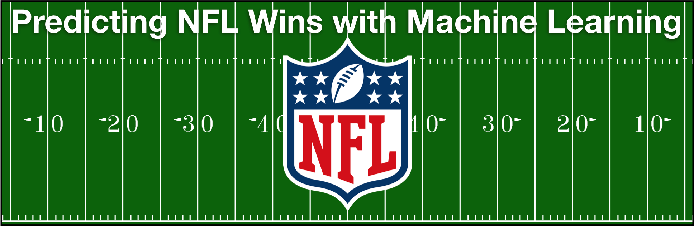
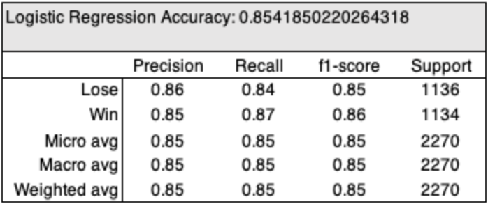
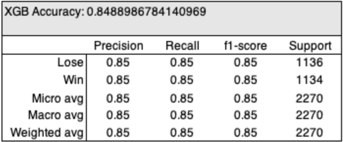
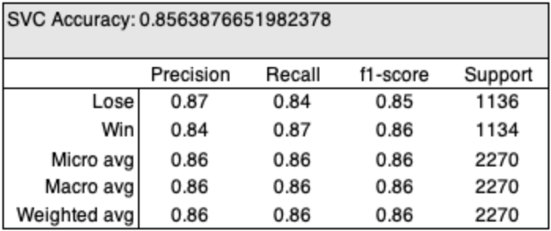
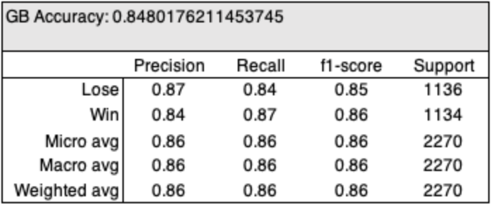

## About

An interactive web application that attempts to predict the win results of NFL games. 

* [App Link](https://machine-nfl.herokuapp.com)
* [Dataset](https://www.reddit.com/r/NFLstatheads/comments/bmrwgp/i_scraped_a_bunch_of_nfl_data_from_2002_through/ "dataset")

## Features
-  Chart of 2019 NFL season with win/loss predictions for all teams
-  Four selectable models - Logistic Regression, XGBoost, SVC, and Optimized Gradient Booster
-  Ablity to compare models using historical data

## Prediction Models

The models were coded in terms of the team winning, “1”, or losing, “0”, the game. The initial model contained 29 variables, but 16 variables that entered into the model had little effect on the results and were removed with most important variables being rush attempts, time of possession, turnovers, pass attempts, fourthdown conversion and score. We trained the model using train test split to split the data into random test and train subsets with a training size of 25%. In an effort to determine how well the different models predicted actual game outcomes, we generated a table of predicted versus actual outcomes.

One of the shortcomings of this type of modeling is that the binary dependent
variable fails to differentiate between levels of victory. Some may argue that the game
statistics from a 50-point victory would be markedly different from those obtained
in a 1-point win. Our models, however, are not concerned with the
margin of victory, only with the specific outcome (win or loss). The Number of wins is what determines the first-place finisher, not the cumulative margins of victory. 

### Logistic Regression

The logistic regression model estimates the probability of the home team winning the game given the differences, or margins, of in-game statistics found to be significant. Logistic regression is an easy to implement and
easy to understand method to apply to prediction problem,
moreover it gives us additional insight through the estimated
coefficients.

### XGBoost Model

The XGBoost library implements the gradient boosting decision tree algorithm. The main benefits of using XGBoost are execution speed and model performance.

Boosting is an ensemble technique where new models are added to correct the errors made by existing models. Models are added sequentially until no further improvements can be made.

It builds the model in a stage-wise fashion like other boosting methods do, and it generalizes them by allowing optimization of an arbitrary differentiable loss function. (Training Loss and Validation Loss)

The logistic function is typically used for binary classification like in our prediction for win or loss. 

### SVC Model

For a dataset consisting of features set and labels set, an SVM classifier builds a model to predict classes for new examples. It assigns new example/data points to one of the classes. If there are only 2 classes then it can be called as a Binary SVM Classifier. SVMS are a byproduct of Neural Network. They are widely applied to pattern classification and regression problems.

Default Kernel Radial Basis Function Kernel: It is also known as RBF kernel. For distance metric squared euclidean distance is used here. It is used to draw completely non-linear hyperplanes.

### Optimized Gradient Booster

Similar to XGBoost, we have optimized the parameters bringing up the accuracy from 53 to 85%

## Technology

- Bootstrap
- JavaScript
- CSS
- Matplotlib
- Scikit Learn
- SciPy
- Joblib
- Pandas
- XGBoost
